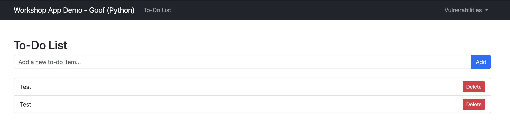

# Workshop App Demo - Goof (Python Edition)

This is a deliberately vulnerable Python Flask application designed for security demonstrations. It is a Python port of the original Node.js and .NET Goof apps.

## Features

- **To-Do List**: A simple, functional to-do list application.
- **SAST Vulnerabilities**: Common web application vulnerabilities for Snyk Code to find.
- **SCA Vulnerabilities**: Dependencies with known vulnerabilities for Snyk Open Source to find.

## Screenshot



## Getting Started

### Prerequisites

- Python 3

### Installation & Running the App

1.  **Clone the repository:**
    ```bash
    git clone https://github.com/JennySnyk/Workshop-App-Demo-Goof-Python.git
    ```
2.  **Navigate to the project directory:**
    ```bash
    cd Workshop-App-Demo-Goof-Python
    ```
3.  **Create and activate a virtual environment:**
    ```bash
    python3 -m venv venv
    source venv/bin/activate
    ```
4.  **Install the dependencies:**
    ```bash
    python3 -m pip install -r requirements.txt
    ```
5.  **Run the application:**
    ```bash
    python3 app.py
    ```

The application will be available at `http://localhost:5001`.

## Vulnerability Details

Here are some of the vulnerabilities included in this application and how to trigger them:

*   **Command Injection**
    *   **Route**: `/vulnerabilities/cmd_injection`
    *   **How to trigger**: In the input field, enter an IP address followed by a command, like `8.8.8.8; ls`. The output of the `ls` command will be displayed on the page.

*   **SQL Injection**
    *   **Route**: `/vulnerabilities/sqli`
    *   **How to trigger**: In the "Username" field, enter the payload `' OR 1=1 --` and any password. You will be logged in as the `admin` user.

*   **Path Traversal**
    *   **Route**: `/vulnerabilities/path_traversal`
    *   **How to trigger**: In the input field, enter `../../.gitignore`. The application will read and display the contents of the `.gitignore` file from the project's root directory.

*   **Cross-Site Scripting (XSS)**
    *   **Route**: `/vulnerabilities/xss`
    *   **How to trigger**: In the comment box, enter the payload `<script>alert('XSS!')</script>`. Submitting the form will execute the script and cause an alert box to appear.

*   **Insecure Deserialization**
    *   **Route**: `/vulnerabilities/insecure_deserialization`
    *   **How to trigger**: In the YAML data field, enter the payload `!!python/object/apply:os.popen ["whoami"]`. The output of the `whoami` command will be printed to the application's console logs, not the web page.

*   **Hardcoded Secret**
    *   **Route**: `/vulnerabilities/hardcoded_secret`
    *   **How to trigger**: Simply navigate to the page. The hardcoded API key is displayed in plain text.

*   **Vulnerable Dependency (SCA)**
    *   The project uses `PyYAML==5.1`, which has a known high-severity vulnerability. This can be detected by running a Snyk Open Source scan.

## Disclaimer

**This application is for educational and demonstration purposes only. Do not deploy it in a production environment.**
